# Panduan Komprehensif Replikasi Database Lintas Engine Berbasis CDC

> **Versi:** 2.0 | **Bahasa:** Indonesia | **Stack:** Kafka + Debezium + Kafka Connect

Panduan ini membahas replikasi data heterogen antar database engine (PostgreSQL, MySQL, Oracle, Greenplum) menggunakan pendekatan **Change Data Capture (CDC)** berbasis Kafka dan Debezium. Mencakup topologi, matriks konektor, pengaturan filter, prasyarat per engine, template konfigurasi JSON, hingga tantangan teknis integrasi.

---

## Daftar Isi

1. [Topologi Komponen Utama & Alur CDC](#1-topologi-komponen-utama--alur-cdc)
2. [Matriks Konektor Skenario One-Way Replication](#2-matriks-konektor-skenario-one-way-replication)
3. [Pengaturan Granular: Filter Tabel & Kolom](#3-pengaturan-granular-filter-tabel--kolom)
4. [Spesifikasi Prasyarat Level Database Engine (Sisi Master)](#4-spesifikasi-prasyarat-level-database-engine-sisi-master)
5. [Spesifikasi Prasyarat Level Database Engine (Sisi Slave/Target)](#5-spesifikasi-prasyarat-level-database-engine-sisi-slavetarget)
6. [Berkas Template Konfigurasi JSON Terpadu (REST API Connect)](#6-berkas-template-konfigurasi-json-terpadu-rest-api-connect)
7. [Tantangan Teknis Integrasi Multi-Platform](#7-tantangan-teknis-integrasi-multi-platform)
8. [Docker Compose Setup Lengkap](#8-docker-compose-setup-lengkap)
9. [Monitoring & Observabilitas](#9-monitoring--observabilitas)
10. [Troubleshooting & FAQ](#10-troubleshooting--faq)
11. [Ringkasan Keputusan Arsitektur](#11-ringkasan-keputusan-arsitektur)

---

## 1. Topologi Komponen Utama & Alur CDC

### 1.1 Konsep CDC (Change Data Capture)

**Change Data Capture (CDC)** adalah teknik menangkap setiap perubahan data (INSERT, UPDATE, DELETE) dari database sumber secara real-time, kemudian meneruskannya ke sistem tujuan. CDC membaca **transaction log** (WAL di PostgreSQL, binlog di MySQL, redo log di Oracle) tanpa membebani database sumber secara signifikan.

**Keunggulan CDC dibanding polling:**

| Aspek | CDC (Log-based) | Polling (Timestamp-based) |
|-------|----------------|--------------------------|
| Latensi | Milidetik (near real-time) | Puluhan detik – menit |
| Beban DB Sumber | Sangat rendah | Sedang–tinggi (query periodik) |
| Capture DELETE | ✅ Ya | ❌ Tidak |
| Akurasi | Tinggi (setiap transaksi) | Risiko miss jika data diupdate lalu dihapus |
| Konsistensi | Transaksional | Eventual |

### 1.2 Diagram Alur CDC Utama

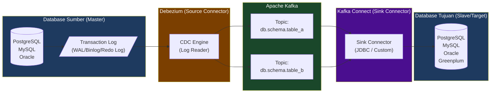

### 1.3 Diagram Arsitektur Multi-Engine

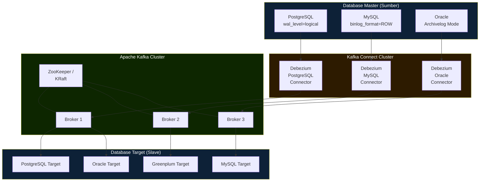

### 1.4 Alur Event CDC (Sequence Diagram)

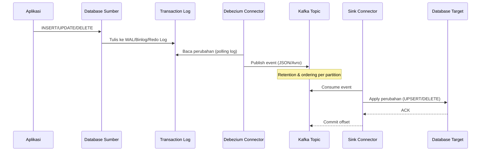

---

## 2. Matriks Konektor Skenario One-Way Replication

### 2.1 Konektor Source (Debezium)

| Database Master | Konektor Debezium | Plugin | Log yang Dibaca |
|----------------|-------------------|--------|----------------|
| PostgreSQL | `debezium-connector-postgres` | pgoutput / wal2json / decoderbufs | WAL (Write-Ahead Log) |
| MySQL / MariaDB | `debezium-connector-mysql` | – | Binary Log (binlog) |
| Oracle | `debezium-connector-oracle` | LogMiner / XStream | Redo Log / Archive Log |
| SQL Server | `debezium-connector-sqlserver` | – | Transaction Log (CDC table) |
| MongoDB | `debezium-connector-mongodb` | – | Oplog |

### 2.2 Konektor Sink (Target)

| Database Target | Konektor Sink | Catatan |
|----------------|---------------|---------|
| PostgreSQL | `io.confluent.connect.jdbc.JdbcSinkConnector` | Butuh driver JDBC PostgreSQL |
| MySQL | `io.confluent.connect.jdbc.JdbcSinkConnector` | Butuh driver JDBC MySQL |
| Oracle | `io.confluent.connect.jdbc.JdbcSinkConnector` | Butuh driver OJDBC |
| Greenplum | JDBC Sink (driver Greenplum) | Pertimbangkan GPSS untuk throughput tinggi |
| Elasticsearch | `io.confluent.connect.elasticsearch.ElasticsearchSinkConnector` | – |
| BigQuery | `com.wepay.kafka.connect.bigquery.BigQuerySinkConnector` | – |

### 2.3 Matriks Skenario One-Way Replication

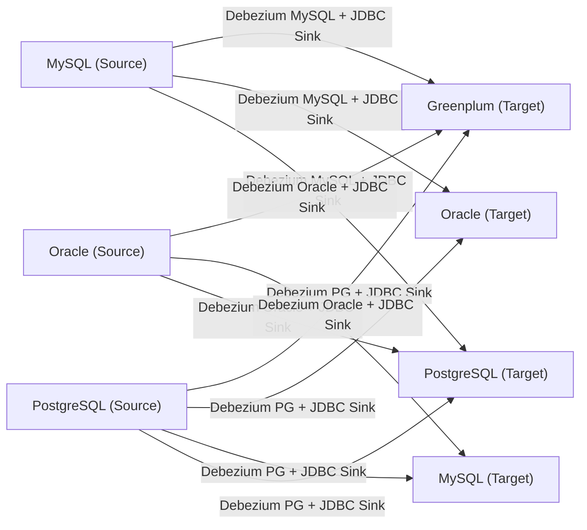

---

## 3. Pengaturan Granular: Filter Tabel & Kolom

### 3.1 Filter Level Tabel

Debezium mendukung whitelist/blacklist tabel menggunakan property konektor:

**Source Connector (PostgreSQL):**
```json
{
  "table.include.list": "public.orders,public.customers,public.products",
  "table.exclude.list": "public.audit_logs,public.temp_data"
}
```

**Source Connector (MySQL):**
```json
{
  "table.include.list": "mydb.orders,mydb.customers",
  "database.include.list": "mydb,reporting_db"
}
```

**Source Connector (Oracle):**
```json
{
  "table.include.list": "MYSCHEMA.ORDERS,MYSCHEMA.CUSTOMERS",
  "schema.include.list": "MYSCHEMA"
}
```

### 3.2 Filter Level Kolom

Untuk mengeksklusi kolom sensitif (password, PII data):

```json
{
  "column.exclude.list": "public.users.password_hash,public.users.ssn,public.customers.credit_card",
  "column.mask.hash.SHA-256.with.salt.CzQma0OczFjKS87X": "public.users.email"
}
```

**Strategi masking kolom:**

| Strategi | Konfigurasi | Hasil |
|----------|------------|-------|
| Exclude (hapus kolom) | `column.exclude.list` | Kolom tidak masuk event CDC |
| Mask (hash) | `column.mask.hash.SHA-256.with.salt.SALT` | Nilai di-hash |
| Mask (literal) | `column.mask.with.10.chars` | Nilai diganti `**********` |
| Truncate | `column.truncate.to.10.chars` | Nilai dipotong |

### 3.3 Diagram Alur Filter

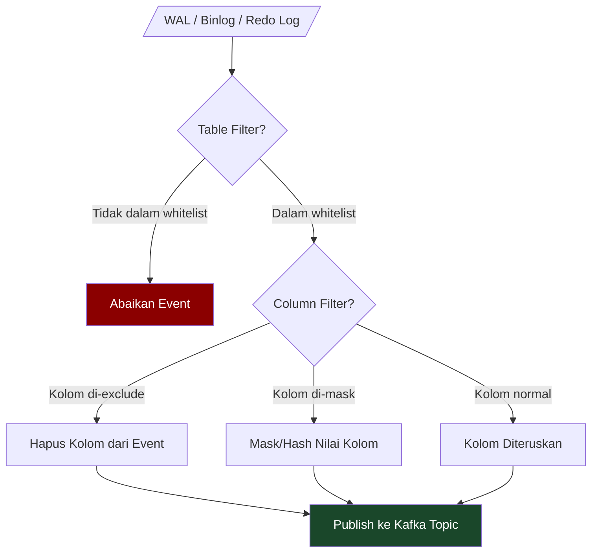

### 3.4 Row-Level Filtering (SMT - Single Message Transformation)

Gunakan **SMT (Single Message Transform)** untuk filter tingkat baris:

```json
{
  "transforms": "filterRows",
  "transforms.filterRows.type": "io.debezium.transforms.Filter",
  "transforms.filterRows.language": "jsr223.groovy",
  "transforms.filterRows.condition": "value.after?.status == 'ACTIVE'"
}
```

---

## 4. Spesifikasi Prasyarat Level Database Engine (Sisi Master)

### A. PostgreSQL Sebagai Master

#### A.1 Konfigurasi `postgresql.conf`

```ini
# Wajib untuk CDC
wal_level = logical
max_replication_slots = 10        # Minimal = jumlah konektor Debezium
max_wal_senders = 10              # Minimal = jumlah konektor + standby
wal_keep_size = 1024              # MB, jaga agar slot tidak tertinggal terlalu jauh

# Opsional tapi direkomendasikan
track_commit_timestamp = on       # Untuk query konsistensi temporal
```

#### A.2 Konfigurasi `pg_hba.conf`

```
# Izinkan koneksi replikasi dari Debezium
host  replication  debezium_user  <ip_kafka_connect>/32  md5
host  all          debezium_user  <ip_kafka_connect>/32  md5
```

#### A.3 Buat User Replikasi

```sql
-- Buat user khusus Debezium
CREATE ROLE debezium_user WITH
  LOGIN
  REPLICATION
  PASSWORD 'StrongPassword123!';

-- Grant akses ke schema
GRANT SELECT ON ALL TABLES IN SCHEMA public TO debezium_user;
ALTER DEFAULT PRIVILEGES IN SCHEMA public GRANT SELECT ON TABLES TO debezium_user;

-- Grant akses ke publication (PostgreSQL 10+)
GRANT CREATE ON DATABASE mydb TO debezium_user;
```

#### A.4 Buat Replication Slot (Opsional – Debezium bisa auto-create)

```sql
-- Dengan plugin pgoutput (built-in PostgreSQL 10+)
SELECT pg_create_logical_replication_slot('debezium_slot', 'pgoutput');

-- Cek slot yang aktif
SELECT * FROM pg_replication_slots;
```

#### A.5 Buat Publication

```sql
-- Publikasikan tabel spesifik
CREATE PUBLICATION debezium_pub FOR TABLE public.orders, public.customers;

-- Atau semua tabel
CREATE PUBLICATION debezium_pub FOR ALL TABLES;
```

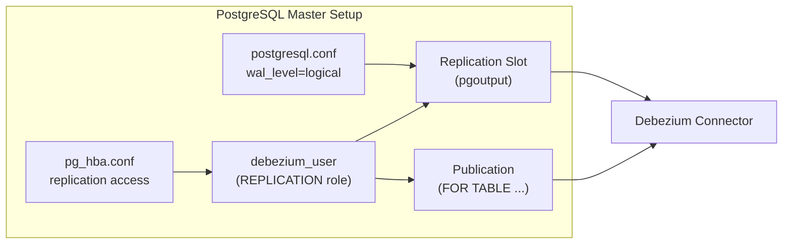

### B. MySQL Sebagai Master

#### B.1 Konfigurasi `my.cnf` / `my.ini`

```ini
[mysqld]
# Wajib untuk CDC
server-id         = 1
log_bin           = /var/log/mysql/mysql-bin.log
binlog_format     = ROW
binlog_row_image  = FULL
expire_logs_days  = 7

# Opsional
binlog_rows_query_log_events = ON
gtid_mode                    = ON
enforce_gtid_consistency     = ON
```

#### B.2 Buat User Replikasi MySQL

```sql
-- Buat user Debezium
CREATE USER 'debezium'@'%' IDENTIFIED BY 'StrongPassword123!';

-- Grant privilege yang diperlukan
GRANT SELECT, RELOAD, SHOW DATABASES, REPLICATION SLAVE, REPLICATION CLIENT
  ON *.* TO 'debezium'@'%';

-- Untuk MySQL 8+
GRANT SELECT ON performance_schema.* TO 'debezium'@'%';

FLUSH PRIVILEGES;
```

#### B.3 Verifikasi Konfigurasi

```sql
-- Cek binlog aktif
SHOW VARIABLES LIKE 'log_bin';
SHOW VARIABLES LIKE 'binlog_format';
SHOW VARIABLES LIKE 'binlog_row_image';

-- Cek posisi binlog saat ini
SHOW MASTER STATUS;

-- Cek user privilege
SHOW GRANTS FOR 'debezium'@'%';
```

### C. Oracle Sebagai Master

#### C.1 Aktifkan Archive Log Mode

```sql
-- Jalankan sebagai SYSDBA
SHUTDOWN IMMEDIATE;
STARTUP MOUNT;
ALTER DATABASE ARCHIVELOG;
ALTER DATABASE OPEN;

-- Verifikasi
SELECT LOG_MODE FROM V$DATABASE;
-- Hasil: ARCHIVELOG
```

#### C.2 Aktifkan Supplemental Logging

```sql
-- Supplemental logging minimal (wajib)
ALTER DATABASE ADD SUPPLEMENTAL LOG DATA;

-- Supplemental logging untuk semua kolom (direkomendasikan untuk Debezium)
ALTER DATABASE ADD SUPPLEMENTAL LOG DATA (ALL) COLUMNS;

-- Atau per tabel
ALTER TABLE MYSCHEMA.ORDERS ADD SUPPLEMENTAL LOG DATA (ALL) COLUMNS;
```

#### C.3 Buat Tablespace Khusus LogMiner

```sql
CREATE TABLESPACE LOGMINER_TBS
  DATAFILE '/opt/oracle/oradata/ORCL/logminer_tbs.dbf'
  SIZE 25M REUSE AUTOEXTEND ON MAXSIZE UNLIMITED;
```

#### C.4 Buat User Debezium Oracle

```sql
-- Untuk Oracle 12c+ Multitenant (CDB)
ALTER SESSION SET CONTAINER = CDB$ROOT;

CREATE USER C##DBZUSER IDENTIFIED BY password
  DEFAULT TABLESPACE LOGMINER_TBS
  QUOTA UNLIMITED ON LOGMINER_TBS
  CONTAINER = ALL;

GRANT CREATE SESSION TO C##DBZUSER CONTAINER = ALL;
GRANT SET CONTAINER TO C##DBZUSER CONTAINER = ALL;
GRANT SELECT ON V_$DATABASE TO C##DBZUSER CONTAINER = ALL;
GRANT FLASHBACK ANY TABLE TO C##DBZUSER CONTAINER = ALL;
GRANT SELECT ANY TABLE TO C##DBZUSER CONTAINER = ALL;
GRANT SELECT_CATALOG_ROLE TO C##DBZUSER CONTAINER = ALL;
GRANT EXECUTE_CATALOG_ROLE TO C##DBZUSER CONTAINER = ALL;
GRANT SELECT ANY TRANSACTION TO C##DBZUSER CONTAINER = ALL;
GRANT SELECT ANY DICTIONARY TO C##DBZUSER CONTAINER = ALL;
GRANT LOGMINING TO C##DBZUSER CONTAINER = ALL;

-- Untuk Oracle non-CDB (12c Standard, 11g)
CREATE USER DBZUSER IDENTIFIED BY password
  DEFAULT TABLESPACE LOGMINER_TBS;

GRANT CREATE SESSION, CONNECT, RESOURCE TO DBZUSER;
GRANT SELECT ON V$DATABASE TO DBZUSER;
GRANT FLASHBACK ANY TABLE TO DBZUSER;
GRANT SELECT ANY TABLE TO DBZUSER;
GRANT SELECT ANY TRANSACTION TO DBZUSER;
GRANT LOGMINING TO DBZUSER;
GRANT EXECUTE ON SYS.DBMS_LOGMNR TO DBZUSER;
GRANT EXECUTE ON SYS.DBMS_LOGMNR_D TO DBZUSER;
```

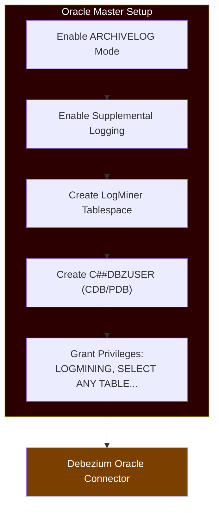

---

## 5. Spesifikasi Prasyarat Level Database Engine (Sisi Slave/Target)

### 5.1 PostgreSQL sebagai Target

```sql
-- Buat user untuk sink connector
CREATE USER sink_user WITH PASSWORD 'StrongPassword123!';

-- Grant akses ke database
GRANT CONNECT ON DATABASE targetdb TO sink_user;
GRANT USAGE ON SCHEMA public TO sink_user;
GRANT CREATE ON SCHEMA public TO sink_user;

-- Grant operasi DML
GRANT SELECT, INSERT, UPDATE, DELETE ON ALL TABLES IN SCHEMA public TO sink_user;
ALTER DEFAULT PRIVILEGES IN SCHEMA public
  GRANT SELECT, INSERT, UPDATE, DELETE ON TABLES TO sink_user;

GRANT CREATE ON DATABASE targetdb TO sink_user;
```

### 5.2 MySQL sebagai Target

```sql
CREATE USER 'sink_user'@'%' IDENTIFIED BY 'StrongPassword123!';

GRANT SELECT, INSERT, UPDATE, DELETE, CREATE, ALTER, INDEX
  ON targetdb.* TO 'sink_user'@'%';

FLUSH PRIVILEGES;
```

### 5.3 Oracle sebagai Target

```sql
CREATE USER SINK_USER IDENTIFIED BY password
  DEFAULT TABLESPACE USERS
  QUOTA UNLIMITED ON USERS;

GRANT CREATE SESSION TO SINK_USER;
GRANT CREATE TABLE TO SINK_USER;
GRANT INSERT ANY TABLE TO SINK_USER;
GRANT UPDATE ANY TABLE TO SINK_USER;
GRANT DELETE ANY TABLE TO SINK_USER;
```

### 5.4 Greenplum sebagai Target

```sql
CREATE USER gp_sink_user WITH PASSWORD 'StrongPassword123!';
GRANT CONNECT ON DATABASE gp_targetdb TO gp_sink_user;
GRANT CREATE ON SCHEMA public TO gp_sink_user;
GRANT INSERT, UPDATE, DELETE, SELECT ON ALL TABLES IN SCHEMA public TO gp_sink_user;

-- Opsional: resource queue untuk throttle
CREATE RESOURCE QUEUE sink_queue WITH (ACTIVE_STATEMENTS=10);
ALTER ROLE gp_sink_user RESOURCE QUEUE sink_queue;
```

### 5.5 Perbandingan Konfigurasi Target

| Aspek | PostgreSQL | MySQL | Oracle | Greenplum |
|-------|-----------|-------|--------|-----------|
| Auto-create tabel | ✅ (JDBC Sink) | ✅ (JDBC Sink) | ⚠️ Parsial | ✅ (JDBC Sink) |
| Upsert mode | ✅ | ✅ | ✅ | ✅ |
| Delete support | ✅ | ✅ | ✅ | ⚠️ Terbatas (heap table) |
| Driver JDBC | `postgresql-*.jar` | `mysql-connector-java-*.jar` | `ojdbc*.jar` | `greenplum-*.jar` |
| Port default | 5432 | 3306 | 1521 | 5432 |

---

## 6. Berkas Template Konfigurasi JSON Terpadu (REST API Connect)

Konfigurasi konektor didaftarkan via REST API Kafka Connect:

```
POST http://kafka-connect:8083/connectors
Content-Type: application/json
```

### A. Contoh Registrasi Konektor Master (MySQL Source)

```json
{
  "name": "mysql-source-connector",
  "config": {
    "connector.class": "io.debezium.connector.mysql.MySqlConnector",
    "tasks.max": "1",

    "database.hostname": "mysql-master",
    "database.port": "3306",
    "database.user": "debezium",
    "database.password": "StrongPassword123!",
    "database.server.id": "1",
    "database.server.name": "mysql_cdc",

    "database.include.list": "mydb",
    "table.include.list": "mydb.orders,mydb.customers,mydb.products",
    "column.exclude.list": "mydb.customers.password_hash,mydb.customers.ssn",

    "database.history.kafka.bootstrap.servers": "kafka:9092",
    "database.history.kafka.topic": "schema-changes.mydb",

    "include.schema.changes": "true",
    "snapshot.mode": "initial",
    "snapshot.locking.mode": "minimal",

    "key.converter": "org.apache.kafka.connect.json.JsonConverter",
    "value.converter": "org.apache.kafka.connect.json.JsonConverter",
    "key.converter.schemas.enable": "false",
    "value.converter.schemas.enable": "false",

    "topic.prefix": "mysql_cdc",
    "heartbeat.interval.ms": "10000",
    "max.batch.size": "2048",
    "poll.interval.ms": "1000",

    "transforms": "unwrap",
    "transforms.unwrap.type": "io.debezium.transforms.ExtractNewRecordState",
    "transforms.unwrap.drop.tombstones": "false",
    "transforms.unwrap.delete.handling.mode": "rewrite",
    "transforms.unwrap.add.fields": "op,ts_ms,source.ts_ms"
  }
}
```

### B. Contoh Registrasi Konektor Slave (Oracle Sink Target)

```json
{
  "name": "oracle-sink-connector",
  "config": {
    "connector.class": "io.confluent.connect.jdbc.JdbcSinkConnector",
    "tasks.max": "4",

    "connection.url": "jdbc:oracle:thin:@oracle-target:1521:ORCL",
    "connection.user": "SINK_USER",
    "connection.password": "StrongPassword123!",

    "topics": "mysql_cdc.mydb.orders,mysql_cdc.mydb.customers",
    "table.name.format": "MYSCHEMA.${topic}",

    "auto.create": "true",
    "auto.evolve": "true",

    "insert.mode": "upsert",
    "pk.mode": "record_key",
    "pk.fields": "id",

    "delete.enabled": "true",

    "key.converter": "org.apache.kafka.connect.json.JsonConverter",
    "value.converter": "org.apache.kafka.connect.json.JsonConverter",
    "key.converter.schemas.enable": "false",
    "value.converter.schemas.enable": "false",

    "batch.size": "1000",
    "max.retries": "10",
    "retry.backoff.ms": "3000",

    "transforms": "renameField",
    "transforms.renameField.type": "org.apache.kafka.connect.transforms.ReplaceField$Value",
    "transforms.renameField.renames": "order_id:ORDER_ID,customer_id:CUSTOMER_ID"
  }
}
```

### 6.3 Contoh Konektor PostgreSQL Source

```json
{
  "name": "postgres-source-connector",
  "config": {
    "connector.class": "io.debezium.connector.postgresql.PostgresConnector",
    "tasks.max": "1",

    "database.hostname": "pg-master",
    "database.port": "5432",
    "database.user": "debezium_user",
    "database.password": "StrongPassword123!",
    "database.dbname": "mydb",
    "topic.prefix": "pg_cdc",

    "plugin.name": "pgoutput",
    "slot.name": "debezium_slot",
    "publication.name": "debezium_pub",
    "publication.autocreate.mode": "filtered",

    "table.include.list": "public.orders,public.customers",
    "column.exclude.list": "public.customers.password_hash",

    "snapshot.mode": "initial",
    "snapshot.locking.mode": "none",

    "key.converter": "org.apache.kafka.connect.json.JsonConverter",
    "value.converter": "org.apache.kafka.connect.json.JsonConverter",
    "key.converter.schemas.enable": "false",
    "value.converter.schemas.enable": "false",

    "heartbeat.interval.ms": "10000",
    "max.batch.size": "2048",

    "transforms": "unwrap",
    "transforms.unwrap.type": "io.debezium.transforms.ExtractNewRecordState",
    "transforms.unwrap.drop.tombstones": "false",
    "transforms.unwrap.delete.handling.mode": "rewrite"
  }
}
```

### 6.4 Contoh Konektor PostgreSQL Sink (dari MySQL Source)

```json
{
  "name": "postgres-sink-connector",
  "config": {
    "connector.class": "io.confluent.connect.jdbc.JdbcSinkConnector",
    "tasks.max": "2",

    "connection.url": "jdbc:postgresql://pg-target:5432/targetdb",
    "connection.user": "sink_user",
    "connection.password": "StrongPassword123!",

    "topics": "mysql_cdc.mydb.orders,mysql_cdc.mydb.customers",
    "table.name.format": "public.${topic}",

    "auto.create": "true",
    "auto.evolve": "true",

    "insert.mode": "upsert",
    "pk.mode": "record_key",
    "pk.fields": "id",
    "delete.enabled": "true",

    "key.converter": "org.apache.kafka.connect.json.JsonConverter",
    "value.converter": "org.apache.kafka.connect.json.JsonConverter",
    "key.converter.schemas.enable": "false",
    "value.converter.schemas.enable": "false",

    "batch.size": "1000",
    "max.retries": "10",
    "retry.backoff.ms": "3000"
  }
}
```

---

## 7. Tantangan Teknis Integrasi Multi-Platform

### 7.1 Peta Tantangan dan Solusi

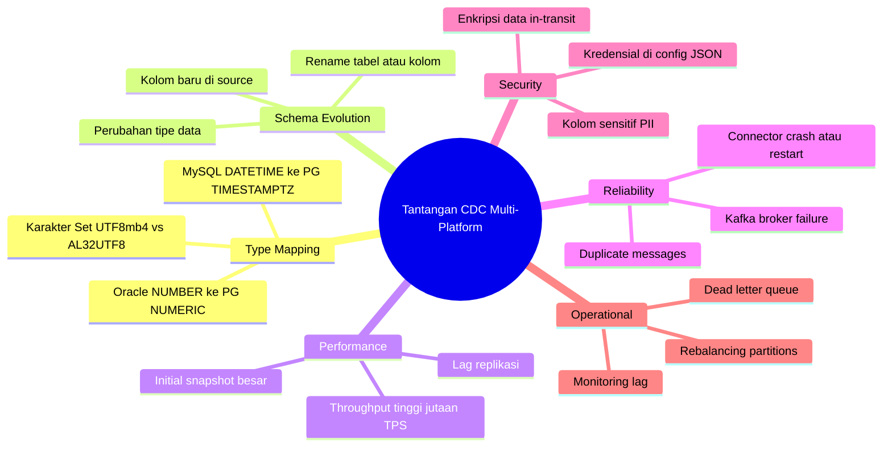

### 7.2 Pemetaan Tipe Data Antar Engine

| Tipe Oracle | Tipe MySQL | Tipe PostgreSQL | Catatan |
|-------------|------------|-----------------|---------|
| `NUMBER(10)` | `INT` | `INTEGER` | |
| `NUMBER(19,4)` | `DECIMAL(19,4)` | `NUMERIC(19,4)` | |
| `VARCHAR2(255)` | `VARCHAR(255)` | `VARCHAR(255)` | |
| `CLOB` | `LONGTEXT` | `TEXT` | Perhatikan ukuran max |
| `DATE` | `DATETIME` | `TIMESTAMP` | Oracle DATE juga menyimpan waktu |
| `TIMESTAMP WITH TIME ZONE` | `DATETIME(6)` | `TIMESTAMPTZ` | |
| `BLOB` | `LONGBLOB` | `BYTEA` | CDC biasanya tidak capture BLOB |
| `CHAR(1)` | `TINYINT(1)` | `BOOLEAN` | Representasi boolean berbeda |

### 7.3 Schema Evolution

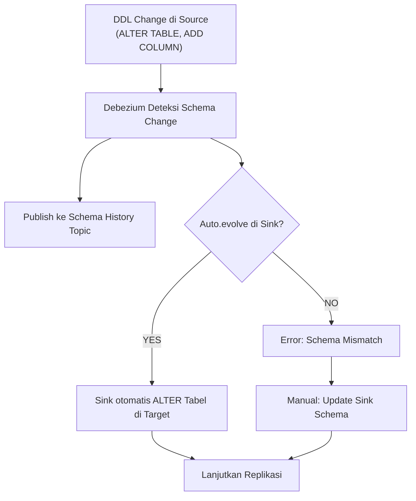

### 7.4 Penanganan Initial Snapshot

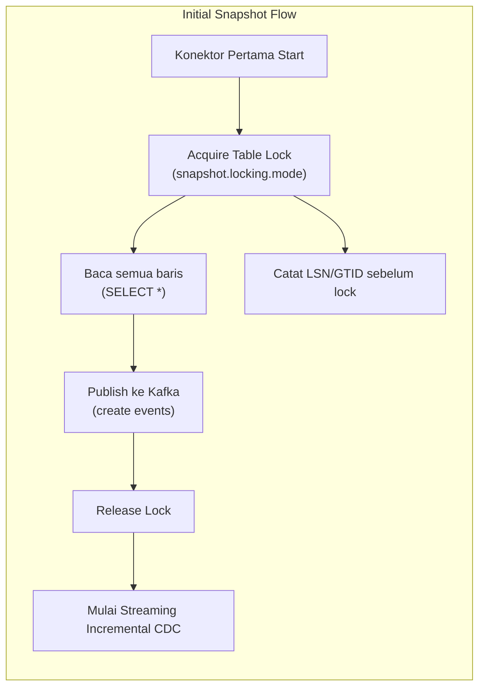

### 7.5 Dead Letter Queue (DLQ)

Untuk menangani event yang gagal diproses:

```json
{
  "errors.tolerance": "all",
  "errors.deadletterqueue.topic.name": "dlq-oracle-sink",
  "errors.deadletterqueue.topic.replication.factor": "3",
  "errors.deadletterqueue.context.headers.enable": "true",
  "errors.log.enable": "true",
  "errors.log.include.messages": "true"
}
```

### 7.6 Keamanan & Enkripsi

```json
{
  "database.ssl.mode": "verify-full",
  "database.ssl.truststore": "/secrets/truststore.jks",
  "database.ssl.truststore.password": "${file:/opt/kafka/config/secrets.properties:truststore.password}",
  "database.ssl.keystore": "/secrets/keystore.jks",
  "database.ssl.keystore.password": "${file:/opt/kafka/config/secrets.properties:keystore.password}"
}
```

---

## 8. Docker Compose Setup Lengkap

### 8.1 Stack Kafka + Debezium (Multi-Engine CDC)

```yaml
version: '3.8'

networks:
  cdc-network:
    driver: bridge

volumes:
  kafka-data:
  zookeeper-data:
  pg-master-data:
  mysql-master-data:

services:

  zookeeper:
    image: confluentinc/cp-zookeeper:7.5.0
    container_name: zookeeper
    networks: [cdc-network]
    environment:
      ZOOKEEPER_CLIENT_PORT: 2181
      ZOOKEEPER_TICK_TIME: 2000
    volumes:
      - zookeeper-data:/var/lib/zookeeper/data

  kafka:
    image: confluentinc/cp-kafka:7.5.0
    container_name: kafka
    networks: [cdc-network]
    depends_on: [zookeeper]
    ports:
      - "9092:9092"
    environment:
      KAFKA_BROKER_ID: 1
      KAFKA_ZOOKEEPER_CONNECT: zookeeper:2181
      KAFKA_LISTENER_SECURITY_PROTOCOL_MAP: INTERNAL:PLAINTEXT,EXTERNAL:PLAINTEXT
      KAFKA_ADVERTISED_LISTENERS: INTERNAL://kafka:29092,EXTERNAL://localhost:9092
      KAFKA_INTER_BROKER_LISTENER_NAME: INTERNAL
      KAFKA_OFFSETS_TOPIC_REPLICATION_FACTOR: 1
      KAFKA_LOG_RETENTION_HOURS: 168
      KAFKA_LOG_RETENTION_BYTES: 10737418240
    volumes:
      - kafka-data:/var/lib/kafka/data

  kafka-connect:
    image: debezium/connect:2.5
    container_name: kafka-connect
    networks: [cdc-network]
    depends_on: [kafka]
    ports:
      - "8083:8083"
    environment:
      BOOTSTRAP_SERVERS: kafka:29092
      GROUP_ID: 1
      CONFIG_STORAGE_TOPIC: _connect-configs
      OFFSET_STORAGE_TOPIC: _connect-offsets
      STATUS_STORAGE_TOPIC: _connect-status
      CONFIG_STORAGE_REPLICATION_FACTOR: 1
      OFFSET_STORAGE_REPLICATION_FACTOR: 1
      STATUS_STORAGE_REPLICATION_FACTOR: 1
      KEY_CONVERTER: org.apache.kafka.connect.json.JsonConverter
      VALUE_CONVERTER: org.apache.kafka.connect.json.JsonConverter
      KEY_CONVERTER_SCHEMAS_ENABLE: "false"
      VALUE_CONVERTER_SCHEMAS_ENABLE: "false"

  kafka-ui:
    image: provectuslabs/kafka-ui:latest
    container_name: kafka-ui
    networks: [cdc-network]
    depends_on: [kafka, kafka-connect]
    ports:
      - "8080:8080"
    environment:
      KAFKA_CLUSTERS_0_NAME: local-cdc
      KAFKA_CLUSTERS_0_BOOTSTRAPSERVERS: kafka:29092
      KAFKA_CLUSTERS_0_KAFKACONNECT_0_NAME: debezium
      KAFKA_CLUSTERS_0_KAFKACONNECT_0_ADDRESS: http://kafka-connect:8083

  pg-master:
    image: postgres:15-alpine
    container_name: pg-master
    networks: [cdc-network]
    ports:
      - "5432:5432"
    environment:
      POSTGRES_USER: myuser
      POSTGRES_PASSWORD: mypassword
      POSTGRES_DB: mydb
    command: >
      postgres
        -c wal_level=logical
        -c max_replication_slots=10
        -c max_wal_senders=10
        -c wal_keep_size=1024
    volumes:
      - pg-master-data:/var/lib/postgresql/data
      - ./init-pg-master.sql:/docker-entrypoint-initdb.d/init.sql

  mysql-master:
    image: mysql:8.0
    container_name: mysql-master
    networks: [cdc-network]
    ports:
      - "3306:3306"
    environment:
      MYSQL_ROOT_PASSWORD: rootpassword
      MYSQL_DATABASE: mydb
      MYSQL_USER: myuser
      MYSQL_PASSWORD: mypassword
    command: >
      --server-id=1
      --log-bin=mysql-bin
      --binlog-format=ROW
      --binlog-row-image=FULL
      --gtid-mode=ON
      --enforce-gtid-consistency=ON
      --binlog-expire-logs-seconds=604800
    volumes:
      - mysql-master-data:/var/lib/mysql
      - ./init-mysql-master.sql:/docker-entrypoint-initdb.d/init.sql

  pg-target:
    image: postgres:15-alpine
    container_name: pg-target
    networks: [cdc-network]
    ports:
      - "5433:5432"
    environment:
      POSTGRES_USER: myuser
      POSTGRES_PASSWORD: mypassword
      POSTGRES_DB: targetdb
    volumes:
      - ./init-pg-target.sql:/docker-entrypoint-initdb.d/init.sql
```

### 8.2 Script Inisialisasi PostgreSQL Master (`init-pg-master.sql`)

```sql
CREATE ROLE debezium_user WITH LOGIN REPLICATION PASSWORD 'StrongPassword123!';

GRANT SELECT ON ALL TABLES IN SCHEMA public TO debezium_user;
ALTER DEFAULT PRIVILEGES IN SCHEMA public GRANT SELECT ON TABLES TO debezium_user;
GRANT CREATE ON DATABASE mydb TO debezium_user;

CREATE TABLE public.orders (
  id          SERIAL PRIMARY KEY,
  customer_id INT          NOT NULL,
  product_id  INT          NOT NULL,
  quantity    INT          NOT NULL DEFAULT 1,
  total_price NUMERIC(15,2),
  status      VARCHAR(50)  DEFAULT 'PENDING',
  created_at  TIMESTAMPTZ  DEFAULT NOW(),
  updated_at  TIMESTAMPTZ  DEFAULT NOW()
);

CREATE TABLE public.customers (
  id            SERIAL PRIMARY KEY,
  username      VARCHAR(50)  NOT NULL UNIQUE,
  email         VARCHAR(100) NOT NULL,
  full_name     VARCHAR(100),
  password_hash VARCHAR(255),
  created_at    TIMESTAMPTZ DEFAULT NOW()
);

-- Buat publication untuk Debezium
CREATE PUBLICATION debezium_pub FOR TABLE public.orders, public.customers;
```

### 8.3 Script Inisialisasi MySQL Master (`init-mysql-master.sql`)

```sql
CREATE USER 'debezium'@'%' IDENTIFIED BY 'StrongPassword123!';
GRANT SELECT, RELOAD, SHOW DATABASES, REPLICATION SLAVE, REPLICATION CLIENT ON *.* TO 'debezium'@'%';
GRANT SELECT ON performance_schema.* TO 'debezium'@'%';
FLUSH PRIVILEGES;

USE mydb;

CREATE TABLE orders (
  id          INT AUTO_INCREMENT PRIMARY KEY,
  customer_id INT          NOT NULL,
  product_id  INT          NOT NULL,
  quantity    INT          NOT NULL DEFAULT 1,
  total_price DECIMAL(15,2),
  status      VARCHAR(50)  DEFAULT 'PENDING',
  created_at  DATETIME     DEFAULT NOW(),
  updated_at  DATETIME     DEFAULT NOW() ON UPDATE NOW()
);

CREATE TABLE customers (
  id            INT AUTO_INCREMENT PRIMARY KEY,
  username      VARCHAR(50)  NOT NULL UNIQUE,
  email         VARCHAR(100) NOT NULL,
  full_name     VARCHAR(100),
  password_hash VARCHAR(255),
  created_at    DATETIME DEFAULT NOW()
);
```

---

## 9. Monitoring & Observabilitas

### 9.1 Metrik Kunci CDC

| Metrik | Perintah / Query | Keterangan |
|--------|-----------------|------------|
| Connector status | `GET /connectors/{name}/status` | Status running/paused/failed |
| Consumer lag | Kafka UI / `kafka-consumer-groups.sh` | Event yang belum terproses |
| Source offset | `GET /connectors/{name}/offsets` | Posisi terakhir di transaction log |
| Replication slot lag (PG) | `SELECT * FROM pg_replication_slots` | Ukuran WAL yang tertahan |
| Binlog lag (MySQL) | `SHOW SLAVE STATUS` | Detik lag replikasi |

### 9.2 Query Monitoring PostgreSQL Replication Slot

```sql
-- Pantau replication slot agar tidak overflow disk
SELECT
  slot_name,
  active,
  restart_lsn,
  confirmed_flush_lsn,
  pg_size_pretty(pg_wal_lsn_diff(pg_current_wal_lsn(), restart_lsn)) AS wal_lag_size,
  pg_wal_lsn_diff(pg_current_wal_lsn(), confirmed_flush_lsn) AS bytes_lag
FROM pg_replication_slots
ORDER BY bytes_lag DESC;
```

```sql
-- Pantau consumer lag per konektor
SELECT
  subname AS connector,
  received_lsn,
  latest_end_lsn,
  latest_end_time,
  (EXTRACT(EPOCH FROM (NOW() - latest_end_time)))::INT AS lag_seconds
FROM pg_stat_subscription;
```

### 9.3 REST API Kafka Connect untuk Monitoring

```bash
# Daftar semua konektor
curl -s http://localhost:8083/connectors | jq .

# Status konektor
curl -s http://localhost:8083/connectors/mysql-source-connector/status | jq .

# Pause konektor
curl -X PUT http://localhost:8083/connectors/mysql-source-connector/pause

# Resume konektor
curl -X PUT http://localhost:8083/connectors/mysql-source-connector/resume

# Restart konektor
curl -X POST http://localhost:8083/connectors/mysql-source-connector/restart

# Restart task tertentu
curl -X POST http://localhost:8083/connectors/mysql-source-connector/tasks/0/restart

# Hapus konektor
curl -X DELETE http://localhost:8083/connectors/mysql-source-connector
```

### 9.4 Diagram Monitoring Pipeline

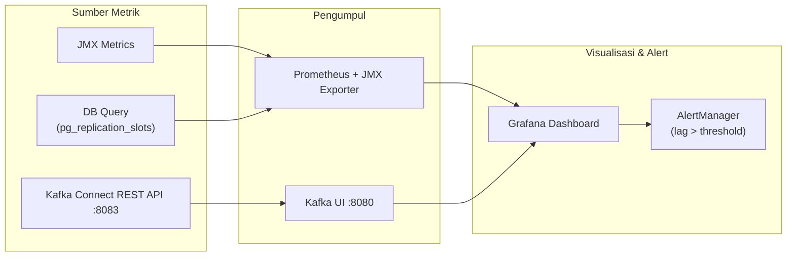

---

## 10. Troubleshooting & FAQ

### 10.1 Masalah Umum dan Solusi

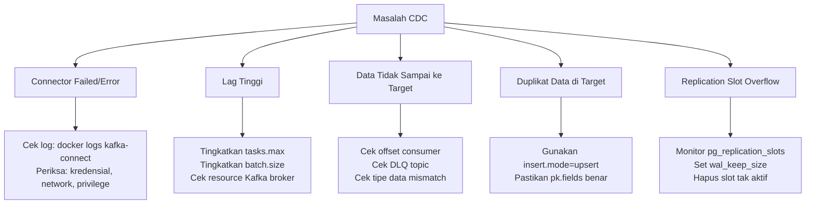

### 10.2 Checklist Debugging CDC

**Step 1: Cek Status Konektor**
```bash
curl -s http://localhost:8083/connectors/mysql-source-connector/status | jq .
```

**Step 2: Cek Log Kafka Connect**
```bash
docker logs kafka-connect 2>&1 | grep -i error | tail -50
```

**Step 3: Cek Topik Kafka Sudah Ada**
```bash
docker exec kafka kafka-topics --list --bootstrap-server localhost:9092
```

**Step 4: Consume Event dari Topik**
```bash
docker exec kafka kafka-console-consumer \
  --bootstrap-server localhost:9092 \
  --topic mysql_cdc.mydb.orders \
  --from-beginning \
  --max-messages 5
```

**Step 5: Cek Dead Letter Queue**
```bash
docker exec kafka kafka-console-consumer \
  --bootstrap-server localhost:9092 \
  --topic dlq-oracle-sink \
  --from-beginning
```

### 10.3 Masalah Spesifik per Engine

#### PostgreSQL Source

| Masalah | Kemungkinan Penyebab | Solusi |
|---------|---------------------|--------|
| `ERROR: logical replication not enabled` | `wal_level != logical` | Set `wal_level=logical`, restart PG |
| `ERROR: replication slot already exists` | Slot tidak dibersihkan | `SELECT pg_drop_replication_slot('debezium_slot')` |
| `FATAL: max_replication_slots exceeded` | Terlalu banyak konektor | Naikkan `max_replication_slots` |
| WAL terus membesar | Konektor mati, slot masih aktif | Hapus slot atau restart konektor |

#### MySQL Source

| Masalah | Kemungkinan Penyebab | Solusi |
|---------|---------------------|--------|
| `Access denied for user 'debezium'` | Privilege kurang | Grant ulang: `REPLICATION SLAVE, REPLICATION CLIENT` |
| `Binlog not enabled` | `log_bin` tidak dikonfigurasi | Enable `log_bin` di `my.cnf`, restart MySQL |
| `binlog_format != ROW` | Format salah | Set `binlog_format=ROW` |
| GTID tidak konsisten | `gtid_mode` partial | Enable `gtid_mode=ON` + `enforce_gtid_consistency=ON` |

#### Oracle Source

| Masalah | Kemungkinan Penyebab | Solusi |
|---------|---------------------|--------|
| `ORA-01325: archive log mode must be enabled` | Database tidak dalam archivelog | `STARTUP MOUNT; ALTER DATABASE ARCHIVELOG; ALTER DATABASE OPEN;` |
| `ORA-01291: missing logfile` | Archive log terhapus | Pastikan retensi archive log cukup |
| `Insufficient privileges` | Grant LOGMINING kurang | Grant ulang privilege LogMiner |

---

## 11. Ringkasan Keputusan Arsitektur

### 11.1 Kapan Menggunakan CDC vs Pendekatan Lain

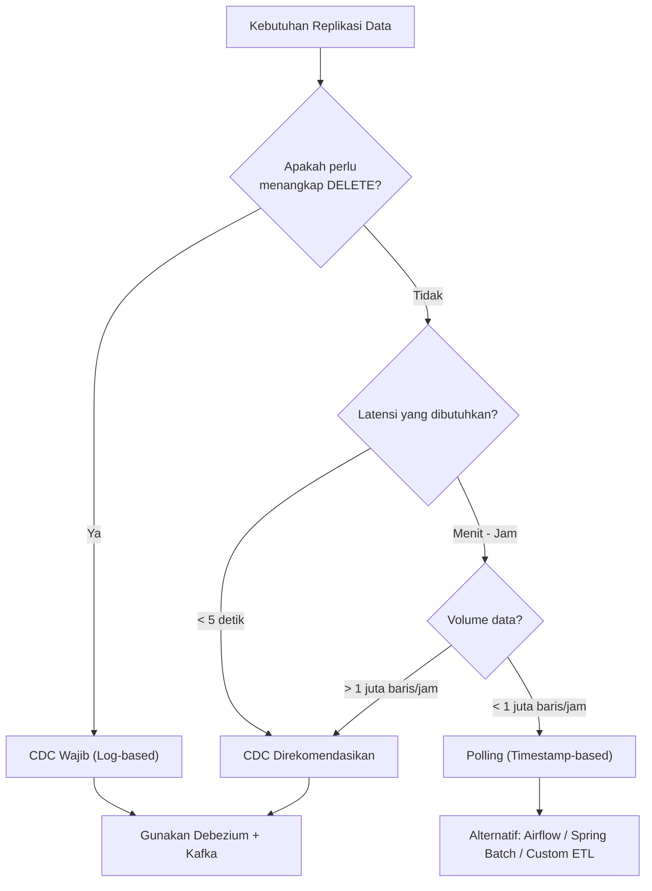

### 11.2 Decision Matrix: Source Connector

| Kriteria | PostgreSQL Debezium | MySQL Debezium | Oracle Debezium |
|----------|--------------------|--------------|-----------------| 
| Kemudahan setup | ⭐⭐⭐⭐ | ⭐⭐⭐⭐ | ⭐⭐ |
| Stabilitas | ⭐⭐⭐⭐⭐ | ⭐⭐⭐⭐⭐ | ⭐⭐⭐ |
| Lisensi driver | Free (pgoutput) | Free | Perlu OJDBC (Oracle) |
| Fitur filtering | ⭐⭐⭐⭐ | ⭐⭐⭐⭐ | ⭐⭐⭐ |
| Dukungan Komunitas | Sangat Aktif | Sangat Aktif | Aktif |

### 11.3 Rekomendasi Umum

> [!TIP]
> - **Mulai dari PostgreSQL atau MySQL** sebagai source untuk kemudahan setup dan stabilitas tertinggi.
> - **Gunakan `snapshot.mode=initial`** untuk snapshot awal, lalu beralih ke streaming CDC.
> - **Selalu monitor replication slot** di PostgreSQL untuk mencegah disk overflow akibat WAL yang tidak di-flush.
> - **Gunakan UPSERT mode** di sink connector untuk idempotency dan ketahanan terhadap duplikat.
> - **Pisahkan credential** menggunakan Kafka Connect Secret Store atau Kubernetes Secrets, jangan hardcode di config JSON.

> [!WARNING]
> - CDC berbasis LogMiner di Oracle memerlukan **Enterprise Edition** atau lisensi tambahan di beberapa versi Oracle.
> - Jangan delete **replication slot** yang aktif di PostgreSQL — ini akan memutus CDC stream.
> - Pastikan **archive log** di Oracle tidak dihapus sebelum Debezium membacanya.

> [!IMPORTANT]
> - Selalu uji **schema evolution** di environment staging sebelum production.
> - Implementasikan **Dead Letter Queue (DLQ)** untuk menangani event yang gagal diproses.
> - Gunakan **Kafka topic retention** yang cukup panjang (minimal 7 hari) untuk recovery.

---

## Referensi

- [Debezium Documentation](https://debezium.io/documentation/)
- [Kafka Connect Documentation](https://kafka.apache.org/documentation/#connect)
- [PostgreSQL Logical Replication](https://www.postgresql.org/docs/current/logical-replication.html)
- [MySQL Binary Log](https://dev.mysql.com/doc/refman/8.0/en/binary-log.html)
- [Oracle LogMiner](https://docs.oracle.com/en/database/oracle/oracle-database/19/sutil/oracle-logminer-utility.html)
- [Confluent JDBC Connector](https://docs.confluent.io/kafka-connectors/jdbc/current/sink-connector/overview.html)

---

*Dokumen ini dapat dijadikan baseline lab lokal maupun fondasi desain replikasi CDC untuk environment non-produksi. Selalu sesuaikan konfigurasi dengan kebutuhan environment produksi Anda.*
