# Rangkuman Belajar Replikasi PostgreSQL

> **Stack:** PostgreSQL 15 + Docker Compose | **Bahasa:** Indonesia

Panduan praktis setup **Physical (Streaming)** dan **Logical Replication** PostgreSQL — dari konsep WAL, setup Docker, replikasi tingkat kolom, monitoring lag, hingga failover & troubleshooting.

---

## Daftar Isi

1. [Ikhtisar Konsep: Physical vs Logical Replication](#1-ikhtisar-konsep-physical-vs-logical-replication)
2. [Cara Kerja WAL (Write-Ahead Log)](#2-cara-kerja-wal-write-ahead-log)
3. [Prasyarat](#3-prasyarat)
4. [Setup Physical (Streaming) Replication](#4-setup-physical-streaming-replication)
5. [Setup Logical Replication](#5-setup-logical-replication)
6. [Replikasi Tingkat Kolom (Column Filter)](#6-replikasi-tingkat-kolom-column-filter)
7. [Manajemen Lanjutan Logical Replication](#7-manajemen-lanjutan-logical-replication)
8. [Replikasi Sinkron (Synchronous Replication)](#8-replikasi-sinkron-synchronous-replication)
9. [Monitoring & Observabilitas](#9-monitoring--observabilitas)
10. [Failover & Switchover (Physical)](#10-failover--switchover-physical)
11. [Hardening & Keamanan](#11-hardening--keamanan)
12. [Troubleshooting](#12-troubleshooting)
13. [Ringkasan Keputusan Arsitektur](#13-ringkasan-keputusan-arsitektur)

---

## 1. Ikhtisar Konsep: Physical vs Logical Replication

PostgreSQL menyediakan dua pendekatan utama untuk replikasi data ke server sekunder:

| Karakteristik | Physical (Streaming) Replication | Logical Replication |
| --- | --- | --- |
| Mekanisme | Menyalin perubahan WAL secara level fisik (cluster-level). | Mengirim perubahan data logis (INSERT/UPDATE/DELETE) via Publisher-Subscriber. |
| Cakupan Data | Seluruh cluster database (struktur + data). | Selektif: bisa tabel tertentu, bahkan kolom tertentu. |
| Sifat Replica | Read-only untuk semua data (hot standby). | Read-only untuk tabel replikasi; bisa punya tabel lokal writeable. |
| Kustomisasi Index | Tidak fleksibel (ikut struktur fisik primary). | Fleksibel, bisa tambah index khusus di subscriber. |
| Versi PostgreSQL | Idealnya major version sama. | Mendukung lintas versi (berguna saat upgrade major). |
| Schema Otomatis | ✅ Ya (seluruh skema ikut) | ❌ Tidak, harus dibuat manual di subscriber. |
| Failover | ✅ Siap digunakan langsung | ❌ Perlu konfigurasi tambahan |
| Use Case Utama | HA / Disaster Recovery | Reporting, Filtering data, Upgrade DB |

### 1.1 Diagram Perbandingan Arsitektur

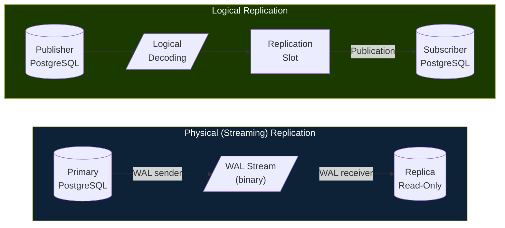

### 1.2 Kapan Memilih Masing-masing?

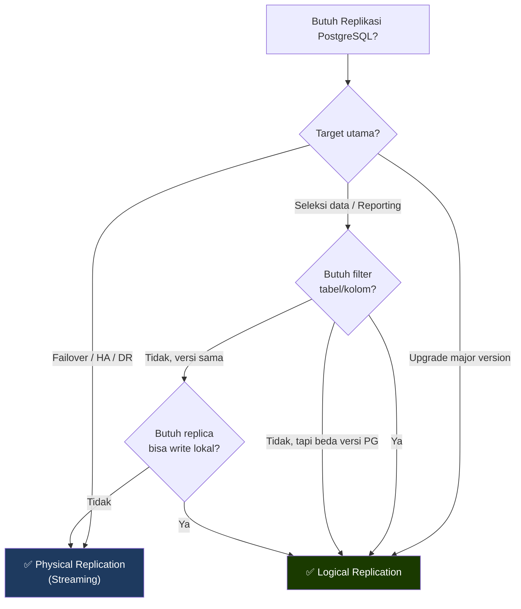

---

## 2. Cara Kerja WAL (Write-Ahead Log)

**WAL (Write-Ahead Log)** adalah mekanisme inti PostgreSQL untuk durabilitas dan replikasi. Setiap perubahan data ditulis ke WAL **sebelum** diterapkan ke data page, memastikan konsistensi meski terjadi crash.

### 2.1 Alur WAL di Physical Replication

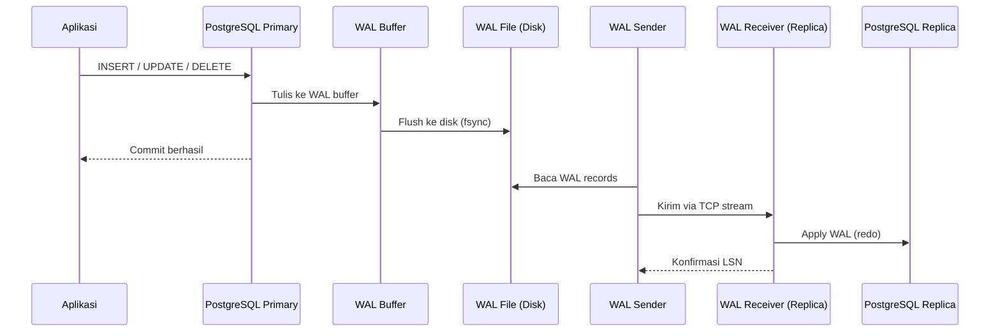

### 2.2 Alur WAL di Logical Replication

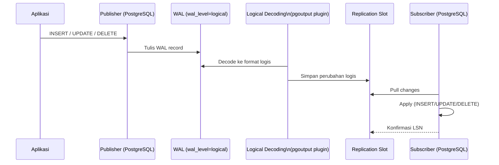

### 2.3 Konfigurasi WAL Level

| `wal_level` | Deskripsi | Mendukung |
|-------------|-----------|-----------|
| `minimal` | Hanya recovery dasar | Tidak bisa replikasi |
| `replica` | Default sejak PG 9.6 | Physical replication |
| `logical` | Level tertinggi | Physical + Logical replication |

```ini
# postgresql.conf
wal_level = logical          # untuk logical; 'replica' cukup untuk physical
max_wal_senders = 10         # jumlah max koneksi WAL sender
max_replication_slots = 10   # jumlah max replication slot
wal_keep_size = 512          # MB WAL yang disimpan untuk replica lambat
```

---

## 3. Prasyarat

- **Docker Engine** dan **Docker Compose** aktif.
- Port host tidak bentrok:
  - `5432` untuk primary/publisher
  - `5433` untuk replica/subscriber
- Folder kerja: `replikasi-db-postgres-basic/`
- Jika menggunakan script shell, beri permission eksekusi:

```bash
chmod +x init-primary.sh
```

### 3.1 Diagram Topologi Docker

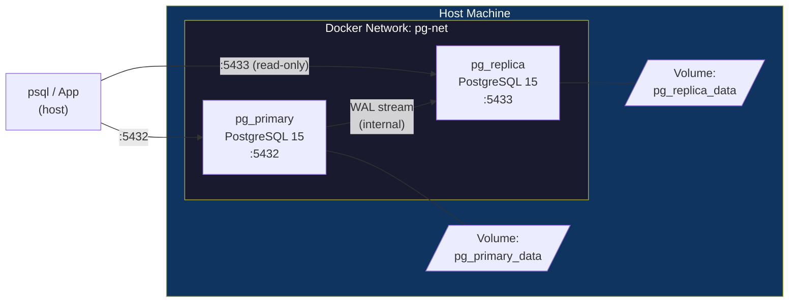

---

## 4. Setup Physical (Streaming) Replication

Physical replication menyalin **seluruh cluster** PostgreSQL secara binary. Replica bersifat read-only (hot standby).

### 4.1 Alur Setup Physical Replication

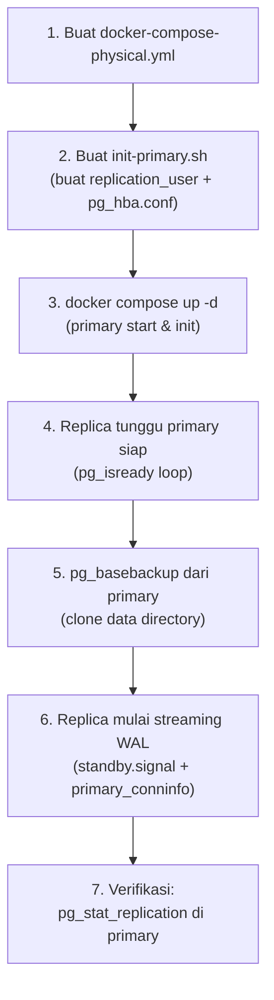

### 4.2 File `docker-compose-physical.yml`

```yaml
version: '3.8'

networks:
  pg-net:
    driver: bridge

volumes:
  pg_primary_data:
  pg_replica_data:

services:
  pg_primary:
    image: postgres:15-alpine
    container_name: pg_primary
    networks: [pg-net]
    environment:
      POSTGRES_USER: myuser
      POSTGRES_PASSWORD: mypassword
      POSTGRES_DB: mydb
    ports:
      - "5432:5432"
    volumes:
      - pg_primary_data:/var/lib/postgresql/data
      - ./init-primary.sh:/docker-entrypoint-initdb.d/init-primary.sh
    healthcheck:
      test: ["CMD-SHELL", "pg_isready -U myuser -d mydb"]
      interval: 5s
      timeout: 5s
      retries: 10

  pg_replica:
    image: postgres:15-alpine
    container_name: pg_replica
    networks: [pg-net]
    environment:
      PGPASSWORD: mypassword
    ports:
      - "5433:5432"
    depends_on:
      pg_primary:
        condition: service_healthy
    entrypoint: >
      bash -c "
      until pg_isready -h pg_primary -p 5432 -U myuser; do
        echo 'Waiting for primary...'; sleep 2;
      done;
      if [ ! -s /var/lib/postgresql/data/PG_VERSION ]; then
        echo 'Running pg_basebackup...'
        pg_basebackup -h pg_primary -D /var/lib/postgresql/data \
          -U replication_user -v -P -X stream -Fp -R
        echo 'pg_basebackup done.'
      fi;
      exec docker-entrypoint.sh postgres
      "
    volumes:
      - pg_replica_data:/var/lib/postgresql/data
```

### 4.3 Script Inisialisasi Primary (`init-primary.sh`)

```bash
#!/bin/bash
set -e

# Buat user replikasi
psql -v ON_ERROR_STOP=1 --username "$POSTGRES_USER" --dbname "$POSTGRES_DB" <<-EOSQL
  CREATE ROLE replication_user WITH REPLICATION LOGIN PASSWORD 'mypassword';
EOSQL

# Izinkan koneksi replikasi dari mana saja (batasi ke subnet di produksi)
echo "host replication replication_user all md5" >> "$PGDATA/pg_hba.conf"

# Reload konfigurasi
pg_ctl reload -D "$PGDATA"
```

### 4.4 Jalankan Stack

```bash
docker compose -f docker-compose-physical.yml up -d

# Pantau log replica saat pertama kali bootstrap
docker logs -f pg_replica
```

### 4.5 Verifikasi Physical Replication

**Di primary** — cek koneksi replica yang sedang streaming:

```sql
SELECT
  client_addr,
  usename,
  state,
  sent_lsn,
  write_lsn,
  flush_lsn,
  replay_lsn,
  sync_state
FROM pg_stat_replication;
```

**Di replica** — konfirmasi mode read-only:

```sql
-- Harus mengembalikan 'on'
SHOW transaction_read_only;

-- Cek lag replikasi saat ini
SELECT now() - pg_last_xact_replay_timestamp() AS replay_lag;

-- Cek apakah sedang dalam standby mode
SELECT pg_is_in_recovery();
```

**Ekspektasi output:**

| Query | Nilai Normal |
|-------|-------------|
| `pg_stat_replication.state` | `streaming` |
| `transaction_read_only` | `on` |
| `pg_is_in_recovery()` | `t` (true) |
| `replay_lag` | < beberapa detik |

---

## 5. Setup Logical Replication

Logical replication menggunakan mekanisme **Publication-Subscription**. Publisher mendeklarasikan apa yang direplikasi; subscriber menarik perubahannya.

### 5.1 Alur Setup Logical Replication

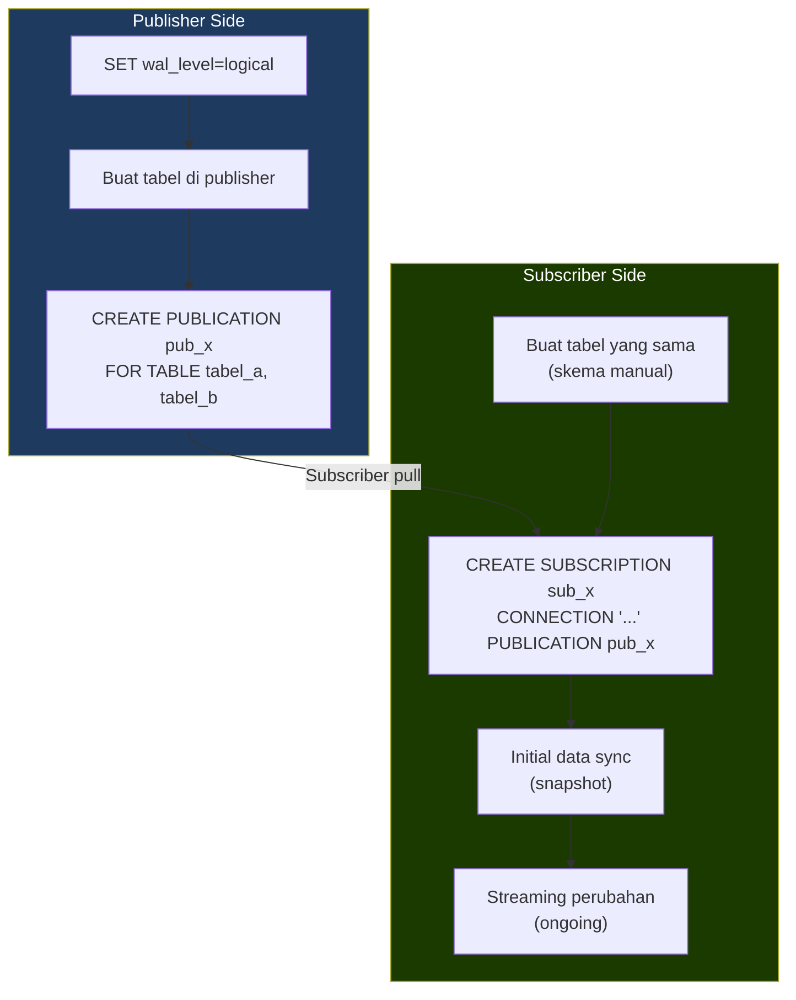

### 5.2 File `docker-compose-logical.yml`

```yaml
version: '3.8'

networks:
  pg-net:
    driver: bridge

services:
  pg_publisher:
    image: postgres:15-alpine
    container_name: pg_publisher
    networks: [pg-net]
    environment:
      POSTGRES_USER: myuser
      POSTGRES_PASSWORD: mypassword
      POSTGRES_DB: mydb
    ports:
      - "5432:5432"
    # wal_level=logical WAJIB untuk logical replication
    command: >
      postgres
        -c wal_level=logical
        -c max_replication_slots=10
        -c max_wal_senders=10
    healthcheck:
      test: ["CMD-SHELL", "pg_isready -U myuser -d mydb"]
      interval: 5s
      timeout: 5s
      retries: 10

  pg_subscriber:
    image: postgres:15-alpine
    container_name: pg_subscriber
    networks: [pg-net]
    environment:
      POSTGRES_USER: myuser
      POSTGRES_PASSWORD: mypassword
      POSTGRES_DB: mydb
    ports:
      - "5433:5432"
    depends_on:
      pg_publisher:
        condition: service_healthy
```

Jalankan:

```bash
docker compose -f docker-compose-logical.yml up -d
```

### 5.3 Buat Tabel di Kedua Sisi (Wajib)

> [!IMPORTANT]
> Logical replication **tidak menyalin skema secara otomatis**. Tabel harus dibuat secara manual di kedua sisi dengan struktur yang kompatibel.

```sql
-- Jalankan di PUBLISHER dan SUBSCRIBER
CREATE TABLE produk (
  id          SERIAL PRIMARY KEY,
  nama_produk VARCHAR(100) NOT NULL,
  harga       NUMERIC(12,2),
  stok        INTEGER DEFAULT 0,
  created_at  TIMESTAMPTZ DEFAULT NOW()
);
```

### 5.4 (Opsional) Tambah Index Khusus di Subscriber

Salah satu keunggulan logical replication: subscriber bisa punya index yang berbeda dari publisher.

```sql
-- Di SUBSCRIBER saja — tidak mengganggu publisher
CREATE INDEX idx_harga_produk  ON produk(harga);
CREATE INDEX idx_stok_produk   ON produk(stok);
CREATE INDEX idx_created_produk ON produk(created_at DESC);
```

### 5.5 Aktifkan Publication (Publisher)

```sql
-- Publikasikan tabel tertentu
CREATE PUBLICATION pub_produk FOR TABLE produk;

-- Atau publikasikan semua tabel (termasuk tabel yang dibuat nanti)
CREATE PUBLICATION pub_semua FOR ALL TABLES;

-- Cek publication yang ada
SELECT pubname, puballtables, pubinsert, pubupdate, pubdelete
FROM pg_publication;
```

### 5.6 Aktifkan Subscription (Subscriber)

```sql
CREATE SUBSCRIPTION sub_produk
  CONNECTION 'host=pg_publisher port=5432 user=myuser password=mypassword dbname=mydb'
  PUBLICATION pub_produk;
```

### 5.7 Verifikasi Logical Replication

**Di publisher** — cek publication dan replication slot:

```sql
-- Daftar tabel dalam publication
SELECT pubname, schemaname, tablename
FROM pg_publication_tables;

-- Cek replication slot yang dibuat subscriber
SELECT slot_name, active, restart_lsn, confirmed_flush_lsn
FROM pg_replication_slots;
```

**Di subscriber** — cek status subscription:

```sql
SELECT
  subname,
  pid,
  received_lsn,
  latest_end_lsn,
  latest_end_time
FROM pg_stat_subscription;
```

**Uji fungsional:**

```sql
-- Di PUBLISHER
INSERT INTO produk (nama_produk, harga, stok) VALUES
  ('Laptop Pro 15', 15000000, 5),
  ('Mouse Wireless', 250000, 50),
  ('Keyboard Mechanical', 800000, 20);

-- Di SUBSCRIBER — data harus muncul
SELECT * FROM produk;

-- Update di publisher
UPDATE produk SET stok = stok - 1 WHERE nama_produk = 'Laptop Pro 15';

-- Delete di publisher
DELETE FROM produk WHERE nama_produk = 'Mouse Wireless';

-- Validasi di subscriber
SELECT * FROM produk ORDER BY id;
```

---

## 6. Replikasi Tingkat Kolom (Column Filter)

Tujuan: mencegah kolom sensitif (password, data PII) ikut direplikasi ke subscriber.

### 6.1 Diagram Alur Column Filter

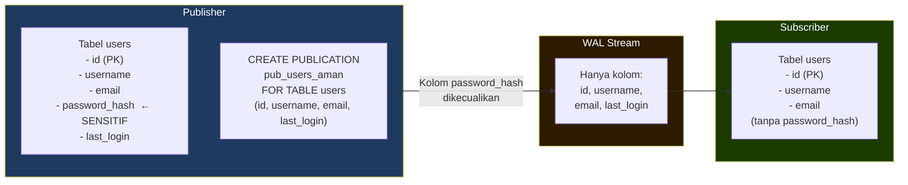

### 6.2 Definisi Tabel di Publisher

```sql
-- Di PUBLISHER
CREATE TABLE users (
  id            SERIAL PRIMARY KEY,
  username      VARCHAR(50)  NOT NULL UNIQUE,
  email         VARCHAR(100) NOT NULL,
  password_hash VARCHAR(255) NOT NULL,   -- Kolom sensitif, tidak direplikasi
  last_login    TIMESTAMPTZ,
  created_at    TIMESTAMPTZ DEFAULT NOW()
);
```

### 6.3 Definisi Tabel di Subscriber (Tanpa Kolom Sensitif)

```sql
-- Di SUBSCRIBER — tidak perlu kolom password_hash
CREATE TABLE users (
  id         SERIAL PRIMARY KEY,
  username   VARCHAR(50)  NOT NULL UNIQUE,
  email      VARCHAR(100) NOT NULL,
  last_login TIMESTAMPTZ,
  created_at TIMESTAMPTZ DEFAULT NOW()
);
```

### 6.4 Publication dengan Daftar Kolom Aman

```sql
-- Tentukan hanya kolom yang aman untuk direplikasi
CREATE PUBLICATION pub_users_aman
  FOR TABLE users (id, username, email, last_login, created_at);
```

### 6.5 Subscription di Subscriber

```sql
CREATE SUBSCRIPTION sub_users_aman
  CONNECTION 'host=pg_publisher port=5432 user=myuser password=mypassword dbname=mydb'
  PUBLICATION pub_users_aman;
```

> [!WARNING]
> - **Kolom Primary Key wajib disertakan** dalam daftar kolom publikasi.
> - Jika PK tidak ada, operasi `UPDATE` dan `DELETE` tidak dapat direplikasi dengan benar karena tidak ada cara mengidentifikasi baris yang berubah.

### 6.6 Verifikasi Column Filter

```sql
-- Di publisher: cek kolom yang direplikasi per tabel
SELECT
  pub.pubname,
  ptrel.schemaname,
  ptrel.tablename,
  ptrel.attnames AS replicated_columns
FROM pg_publication pub
JOIN pg_publication_tables ptrel ON pub.pubname = ptrel.pubname
WHERE pub.pubname = 'pub_users_aman';
```

---

## 7. Manajemen Lanjutan Logical Replication

### 7.1 Menambahkan Tabel Baru ke Publication yang Sudah Ada

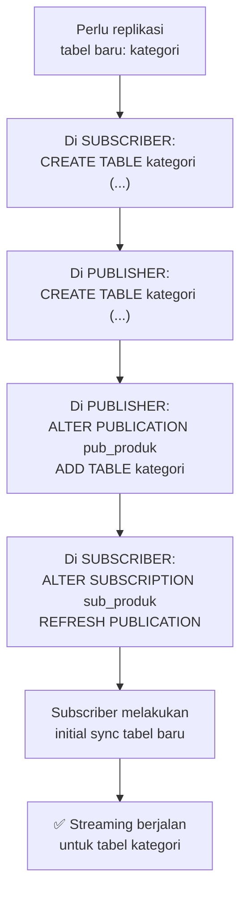

```sql
-- Step 1: Buat tabel di SUBSCRIBER terlebih dahulu
CREATE TABLE kategori (
  id       SERIAL PRIMARY KEY,
  nama     VARCHAR(100) NOT NULL,
  deskripsi TEXT
);

-- Step 2: Buat tabel yang sama di PUBLISHER
CREATE TABLE kategori (
  id       SERIAL PRIMARY KEY,
  nama     VARCHAR(100) NOT NULL,
  deskripsi TEXT
);

-- Step 3: Tambahkan ke publication yang sudah ada (di PUBLISHER)
ALTER PUBLICATION pub_produk ADD TABLE kategori;

-- Step 4: Refresh subscription agar subscriber tahu ada tabel baru (di SUBSCRIBER)
ALTER SUBSCRIPTION sub_produk REFRESH PUBLICATION;
```

### 7.2 Menghapus Tabel dari Publication

```sql
-- Di PUBLISHER
ALTER PUBLICATION pub_produk DROP TABLE kategori;

-- Subscriber otomatis berhenti menerima perubahan tabel tersebut
-- Data yang sudah ada di subscriber tetap ada
```

### 7.3 Kapan ALTER vs Buat Publication Baru

| Situasi | Rekomendasi |
|---------|-------------|
| Tabel baru, domain bisnis sama | `ALTER PUBLICATION ... ADD TABLE` |
| Domain data berbeda (contoh: keuangan vs HR) | Buat publication baru |
| Target subscriber berbeda | Buat publication baru per subscriber |
| Ingin isolasi kegagalan antar-aliran | Buat publication baru |

### 7.4 Manajemen Replication Slot

> [!WARNING]
> Replication slot yang tidak aktif (konektor mati) akan menyebabkan WAL menumpuk di disk karena PostgreSQL tidak akan menghapus WAL hingga semua slot mengkonfirmasi pembacaannya.

```sql
-- Cek semua replication slot
SELECT
  slot_name,
  plugin,
  slot_type,
  active,
  restart_lsn,
  confirmed_flush_lsn,
  pg_size_pretty(
    pg_wal_lsn_diff(pg_current_wal_lsn(), restart_lsn)
  ) AS wal_retained
FROM pg_replication_slots;

-- Hapus slot yang tidak aktif (hati-hati!)
SELECT pg_drop_replication_slot('nama_slot');
```

### 7.5 Pause & Resume Subscription

```sql
-- Pause subscription sementara (maintenance)
ALTER SUBSCRIPTION sub_produk DISABLE;

-- Cek status
SELECT subname, subenabled FROM pg_subscription;

-- Resume subscription
ALTER SUBSCRIPTION sub_produk ENABLE;

-- Hapus subscription sepenuhnya
DROP SUBSCRIPTION sub_produk;
```

---

## 8. Replikasi Sinkron (Synchronous Replication)

Secara default, PostgreSQL menggunakan **asynchronous replication** — primary commit langsung tanpa menunggu replica. **Synchronous replication** memastikan setiap commit dikonfirmasi oleh minimal satu replica sebelum dikembalikan ke aplikasi.

### 8.1 Diagram Async vs Sync

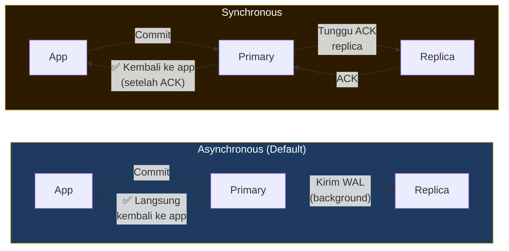

### 8.2 Konfigurasi Synchronous Replication

```ini
# Di postgresql.conf (Primary)
synchronous_commit = on                      # default: on
synchronous_standby_names = 'pg_replica'     # nama aplikasi replica
# Atau menggunakan quorum commit (minimal 1 dari N replica):
synchronous_standby_names = 'ANY 1 (pg_replica1, pg_replica2)'
```

```ini
# Di recovery.conf atau postgresql.auto.conf (Replica)
primary_conninfo = 'host=pg_primary port=5432 user=replication_user password=mypassword application_name=pg_replica'
```

### 8.3 Trade-off Sync vs Async

| Aspek | Async | Sync |
|-------|-------|------|
| Latensi Write | Rendah | Lebih tinggi (menunggu ACK) |
| Risk Data Loss | Ada (minimal) jika primary crash | Tidak ada (zero data loss) |
| Availability | Lebih tinggi | Lebih rendah (jika replica down, primary menunggu) |
| Use Case | Reporting replicas, non-critical | Finansial, data kritikal |

---

## 9. Monitoring & Observabilitas

### 9.1 Diagram Monitoring Pipeline

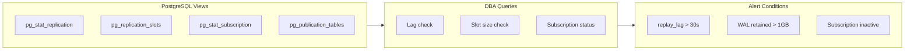

### 9.2 Monitoring Physical Replication

```sql
-- ============================================================
-- 1. Status replica aktif (di PRIMARY)
-- ============================================================
SELECT
  client_addr,
  usename,
  application_name,
  state,
  sent_lsn,
  write_lsn,
  flush_lsn,
  replay_lsn,
  sync_state,
  -- Hitung lag dalam bytes
  pg_wal_lsn_diff(sent_lsn, replay_lsn) AS lag_bytes
FROM pg_stat_replication;

-- ============================================================
-- 2. Replay lag di REPLICA (waktu)
-- ============================================================
SELECT
  now() - pg_last_xact_replay_timestamp() AS replay_lag_seconds,
  pg_last_xact_replay_timestamp()          AS last_replayed_at,
  pg_is_in_recovery()                      AS is_standby,
  pg_last_wal_receive_lsn()               AS received_lsn,
  pg_last_wal_replay_lsn()               AS replayed_lsn;

-- ============================================================
-- 3. Ukuran WAL yang tertahan oleh replication slot
-- ============================================================
SELECT
  slot_name,
  active,
  pg_size_pretty(
    pg_wal_lsn_diff(pg_current_wal_lsn(), restart_lsn)
  ) AS wal_retained_size
FROM pg_replication_slots
ORDER BY pg_wal_lsn_diff(pg_current_wal_lsn(), restart_lsn) DESC;
```

### 9.3 Monitoring Logical Replication

```sql
-- ============================================================
-- 1. Status subscription (di SUBSCRIBER)
-- ============================================================
SELECT
  subname,
  pid,
  received_lsn,
  latest_end_lsn,
  latest_end_time,
  (EXTRACT(EPOCH FROM (now() - latest_end_time)))::INT AS lag_seconds
FROM pg_stat_subscription;

-- ============================================================
-- 2. Daftar tabel dalam semua publication (di PUBLISHER)
-- ============================================================
SELECT
  pub.pubname,
  pub.pubinsert,
  pub.pubupdate,
  pub.pubdelete,
  pt.schemaname,
  pt.tablename
FROM pg_publication pub
JOIN pg_publication_tables pt ON pub.pubname = pt.pubname
ORDER BY pub.pubname, pt.tablename;

-- ============================================================
-- 3. Cek subscription yang tidak aktif (lag > 60 detik)
-- ============================================================
SELECT
  subname,
  latest_end_time,
  EXTRACT(EPOCH FROM (now() - latest_end_time)) AS lag_seconds
FROM pg_stat_subscription
WHERE EXTRACT(EPOCH FROM (now() - latest_end_time)) > 60
   OR latest_end_time IS NULL;
```

### 9.4 Checklist Monitoring Harian

| Item | Query / Perintah | Threshold |
|------|-----------------|-----------|
| Replica lag (waktu) | `now() - pg_last_xact_replay_timestamp()` | < 30 detik |
| WAL slot size | `pg_replication_slots` | < 1 GB |
| Subscription aktif | `pg_stat_subscription` | status `streaming` |
| Disk WAL usage | `pg_ls_waldir()` atau `df -h` | < 80% disk |
| Replication slot aktif | `pg_replication_slots WHERE active = false` | 0 slot inactive |

---

## 10. Failover & Switchover (Physical)

### 10.1 Diagram Alur Failover

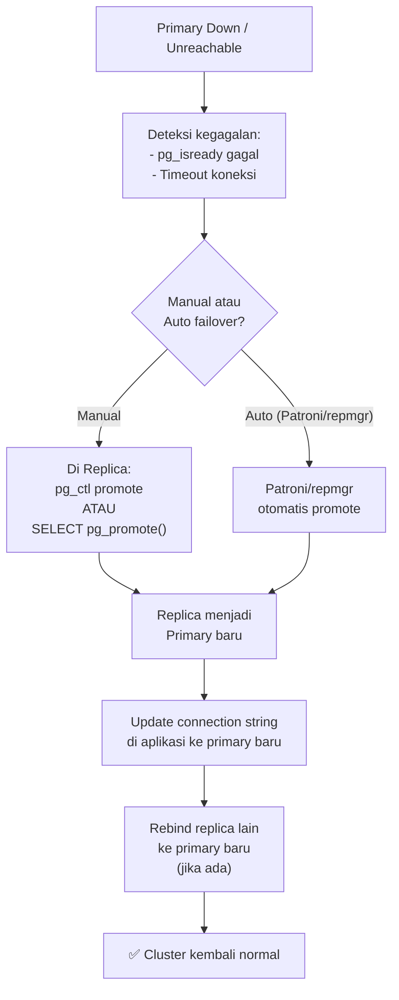

### 10.2 Langkah Failover Manual

```bash
# ── Di REPLICA (yang akan dipromote) ──────────────────────────
# Cek apakah replica siap (sudah catch up dengan primary)
psql -h localhost -p 5433 -U myuser -c "SELECT pg_last_wal_receive_lsn(), pg_last_wal_replay_lsn();"

# Promote replica menjadi primary baru
# Cara 1: via pg_ctl
docker exec pg_replica pg_ctl promote -D /var/lib/postgresql/data

# Cara 2: via SQL (PostgreSQL 12+)
psql -h localhost -p 5433 -U myuser -c "SELECT pg_promote();"

# Verifikasi sudah tidak lagi dalam recovery mode
psql -h localhost -p 5433 -U myuser -c "SELECT pg_is_in_recovery();"
# Harus: f (false)
```

### 10.3 Langkah Switchover (Terencana)

Switchover adalah failover terencana — primary sengaja diturunkan untuk maintenance.

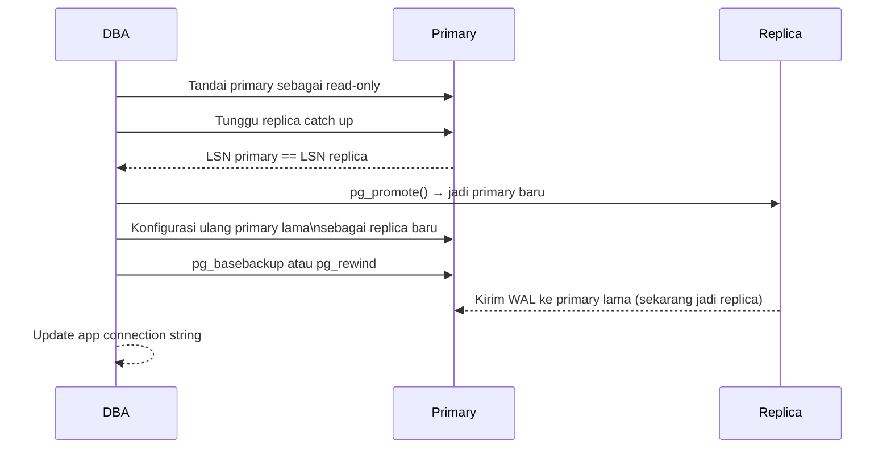

```bash
# Step 1: Checkpoint di primary agar WAL bersih
psql -h localhost -p 5432 -U myuser -c "CHECKPOINT;"

# Step 2: Pastikan replica sudah fully caught up
psql -h localhost -p 5432 -U myuser -c "
  SELECT sent_lsn = replay_lsn AS is_synced
  FROM pg_stat_replication;"

# Step 3: Promote replica
psql -h localhost -p 5433 -U myuser -c "SELECT pg_promote();"

# Step 4: Rebuild primary lama sebagai replica (menggunakan pg_rewind)
# pg_rewind lebih cepat dari pg_basebackup untuk server yang baru saja turun
docker exec pg_primary pg_rewind \
  --target-pgdata /var/lib/postgresql/data \
  --source-server "host=pg_replica port=5432 user=replication_user password=mypassword"
```

---

## 11. Hardening & Keamanan

### 11.1 Diagram Keamanan Replikasi

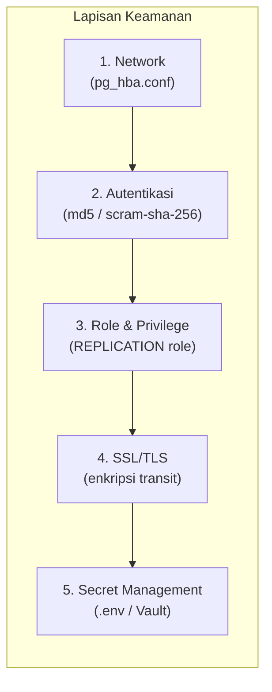

### 11.2 Rekomendasi Konfigurasi Aman

```ini
# ── pg_hba.conf ────────────────────────────────────────────
# Izinkan replikasi hanya dari subnet tertentu
host  replication  replication_user  192.168.1.0/24  scram-sha-256

# Jangan pakai 'all' atau '0.0.0.0/0' di produksi
```

```sql
-- Buat user replikasi dengan hak minimal
CREATE ROLE replication_user WITH
  REPLICATION
  LOGIN
  PASSWORD 'GuntiPassword!Y@ngKu@t';

-- Untuk logical replication: user subscriber harus bisa login dan SELECT
CREATE ROLE subscriber_user WITH LOGIN PASSWORD 'P@ssSubscriber!';
GRANT SELECT ON ALL TABLES IN SCHEMA public TO subscriber_user;
ALTER DEFAULT PRIVILEGES IN SCHEMA public GRANT SELECT ON TABLES TO subscriber_user;
```

```yaml
# ── .env file (jangan commit ke git!) ──────────────────────
POSTGRES_USER=myuser
POSTGRES_PASSWORD=P@ssw0rdK0mpl3ks!
REPLICATION_PASSWORD=R3pl!cati0nS3cur3
```

```bash
# ── .gitignore ──────────────────────────────────────────────
echo ".env" >> .gitignore
echo "*.key" >> .gitignore
```

### 11.3 Aktifkan SSL untuk Koneksi Replikasi

```ini
# postgresql.conf
ssl = on
ssl_cert_file = 'server.crt'
ssl_key_file  = 'server.key'
ssl_ca_file   = 'ca.crt'
```

```ini
# pg_hba.conf — wajibkan SSL
hostssl  replication  replication_user  192.168.1.0/24  scram-sha-256
```

---

## 12. Troubleshooting

### 12.1 Decision Tree Troubleshooting

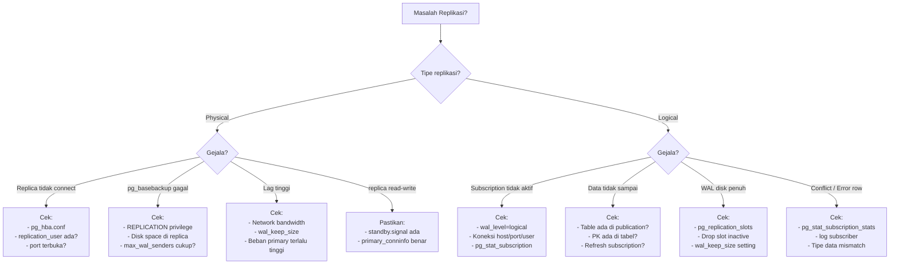

### 12.2 Masalah: Subscription Tidak Jalan

**Kemungkinan penyebab & solusi:**

```bash
# 1. Cek wal_level di publisher
psql -h localhost -p 5432 -U myuser -c "SHOW wal_level;"
# Harus: logical

# 2. Cek log publisher untuk pesan error
docker logs pg_publisher 2>&1 | grep -E "ERROR|FATAL|WARNING" | tail -30

# 3. Cek log subscriber
docker logs pg_subscriber 2>&1 | grep -E "ERROR|FATAL|WARNING" | tail -30

# 4. Cek koneksi dari subscriber ke publisher
docker exec pg_subscriber psql \
  "host=pg_publisher port=5432 user=myuser password=mypassword dbname=mydb" \
  -c "SELECT 1;"
```

```sql
-- 5. Cek privilege user
SELECT rolreplication, rolsuper, rolcanlogin
FROM pg_roles
WHERE rolname = 'myuser';

-- 6. Cek subscription status detail
SELECT subname, subenabled, subconninfo, subpublications
FROM pg_subscription;
```

### 12.3 Masalah: Replica Physical Gagal Clone Awal

```bash
# Hapus data directory replica yang korup lalu bootstrap ulang
docker compose -f docker-compose-physical.yml down
docker volume rm replikasi-db-postgres-basic_pg_replica_data
docker compose -f docker-compose-physical.yml up -d

# Pantau proses pg_basebackup
docker logs -f pg_replica
```

```sql
-- Pastikan max_wal_senders cukup di primary
SHOW max_wal_senders;
-- Naikan jika perlu di postgresql.conf:
-- max_wal_senders = 10
```

### 12.4 Masalah: WAL Menumpuk / Disk Penuh

```sql
-- Cek slot mana yang menyebabkan WAL tertahan
SELECT
  slot_name,
  active,
  pg_size_pretty(
    pg_wal_lsn_diff(pg_current_wal_lsn(), restart_lsn)
  ) AS wal_lag
FROM pg_replication_slots
ORDER BY pg_wal_lsn_diff(pg_current_wal_lsn(), restart_lsn) DESC;

-- Jika slot tidak aktif dan tidak dibutuhkan lagi, hapus:
SELECT pg_drop_replication_slot('nama_slot_tidak_aktif');
```

### 12.5 Tabel Masalah-Solusi Ringkas

| Gejala | Kemungkinan Penyebab | Solusi |
|--------|---------------------|--------|
| `could not connect to the primary server` | pg_hba.conf tidak mengizinkan | Tambah rule replication di pg_hba.conf |
| `replication slot already exists` | Slot dari percobaan sebelumnya | `pg_drop_replication_slot('nama')` |
| `FATAL: max_wal_senders connections` | Terlalu banyak koneksi | Naikkan `max_wal_senders` |
| Subscription status `disabled` | Subscription di-disable | `ALTER SUBSCRIPTION sub ENABLE` |
| Data tidak terreplikasi | Tabel tidak ada di publication | `ALTER PUBLICATION pub ADD TABLE tbl` + `ALTER SUBSCRIPTION sub REFRESH PUBLICATION` |
| `ERROR: cannot update table without replica identity` | Tidak ada PK/REPLICA IDENTITY | Tambahkan PRIMARY KEY atau `ALTER TABLE SET REPLICA IDENTITY FULL` |
| WAL directory membesar | Replication slot inactive | Drop slot atau restart subscriber |

---

## 13. Ringkasan Keputusan Arsitektur

### 13.1 Matriks Pemilihan Metode

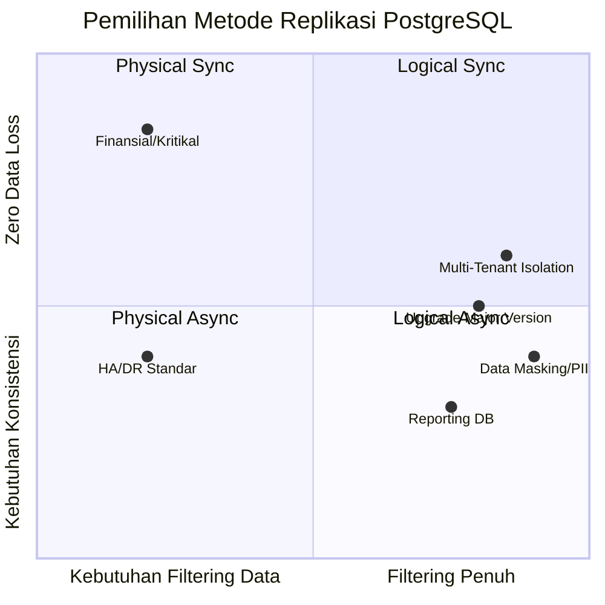

### 13.2 Ringkasan Keputusan

| Kebutuhan | Pilihan | Alasan |
|-----------|---------|--------|
| Failover cepat (HA/DR) | Physical Async | Low overhead, siap promote |
| Zero data loss (kritikal) | Physical Sync | ACK sebelum commit |
| Tabel tertentu saja | Logical | Granularity tinggi |
| Kolom sensitif dikecualikan | Logical + Column Filter | Filter di level publikasi |
| Upgrade major PostgreSQL | Logical | Bisa lintas versi |
| Replica untuk reporting | Physical atau Logical | Tergantung kebutuhan filter |
| Replica bisa write lokal | Logical | Physical = pure read-only |

### 13.3 Skenario Uji Minimal Setelah Setup

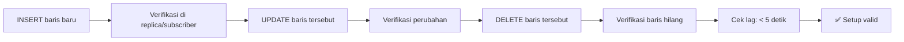

```sql
-- Uji INSERT
INSERT INTO produk (nama_produk, harga) VALUES ('Test Item', 99000);

-- Di replica/subscriber: verifikasi
SELECT * FROM produk WHERE nama_produk = 'Test Item';

-- Uji UPDATE
UPDATE produk SET harga = 109000 WHERE nama_produk = 'Test Item';

-- Di replica/subscriber: verifikasi perubahan
SELECT harga FROM produk WHERE nama_produk = 'Test Item';
-- Ekspektasi: 109000

-- Uji DELETE
DELETE FROM produk WHERE nama_produk = 'Test Item';

-- Di replica/subscriber: verifikasi baris hilang
SELECT COUNT(*) FROM produk WHERE nama_produk = 'Test Item';
-- Ekspektasi: 0
```

---

> [!TIP]
> **Rekomendasi untuk Production:**
> - Gunakan **password kuat** dan jangan pakai default contoh.
> - Batasi akses `pg_hba.conf` ke subnet spesifik.
> - Monitor `pg_replication_slots` secara berkala — slot inactive = disk WAL membengkak.
> - Gunakan **Patroni** atau **repmgr** untuk manajemen failover otomatis di production.
> - Simpan kredensial di `.env` atau secret manager (Vault, AWS Secrets Manager).

---

*Dokumen ini dapat dijadikan baseline lab lokal maupun fondasi desain replikasi untuk environment non-produksi. Selalu sesuaikan konfigurasi dengan kebutuhan spesifik produksi Anda.*
